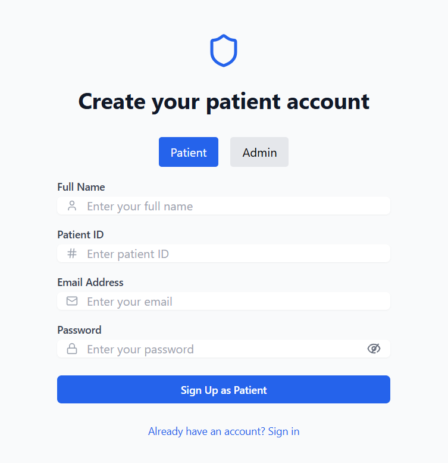
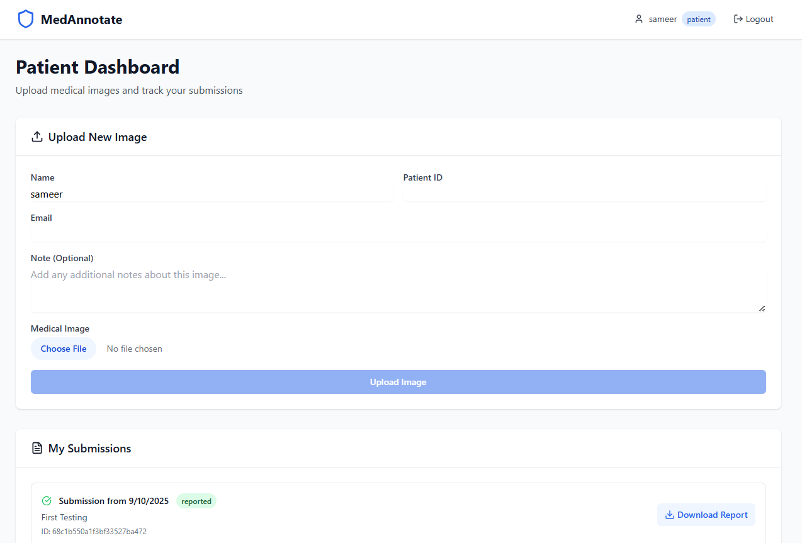
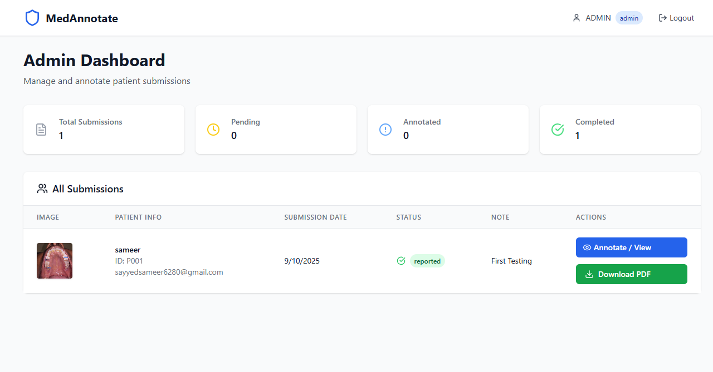
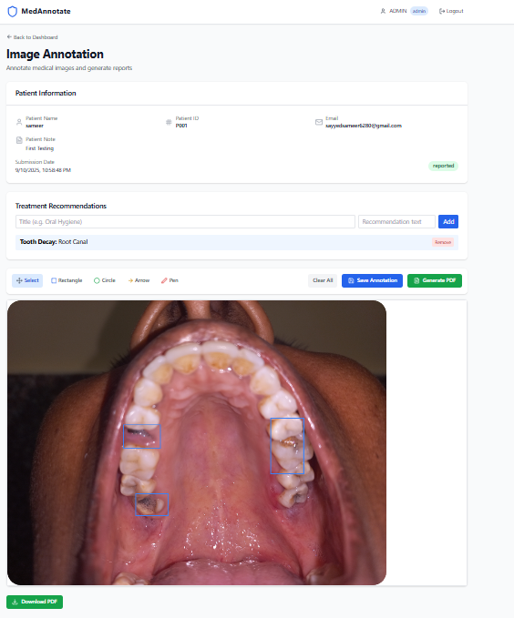
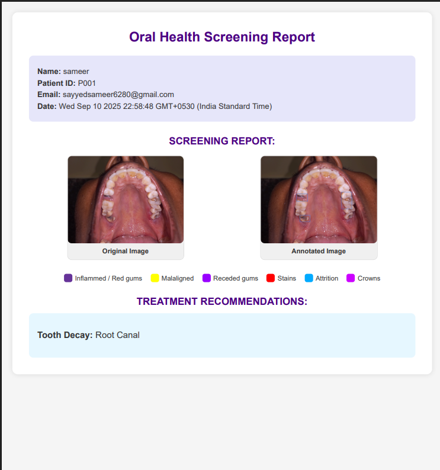

# OralVis

OralVis is a full-stack web application for oral health report annotation and management. It consists of a React frontend and a Node.js/Express backend, supporting user authentication, image annotation, report generation, and role-based access.

---

## Demo Screenshots
Below are some screenshots demonstrating the application features:

<h3 align="center">Login Page</h3>
<p align="center">
  
</p>

<h3 align="center">Patient Dashboard</h3>
<p align="center">
  
</p>

<h3 align="center">Admin Dashboard</h3>
<p align="center">
  
</p>

<h3 align="center">Annotation Page</h3>
<p align="center">
  
</p>

<h3 align="center">PDF Report</h3>
<p align="center">
  
</p>

## Table of Contents
- [Features](#features)
- [Project Structure](#project-structure)
- [Setup Instructions](#setup-instructions)
- [Backend API Endpoints](#backend-api-endpoints)
- [Frontend Overview](#frontend-overview)
- [Environment Variables](#environment-variables)
- [Scripts](#scripts)
- [Contributing](#contributing)
- [License](#license)

---

## Features
- User authentication (JWT, roles: admin, patient)
- Image upload and annotation
- PDF report generation
- Role-based dashboards
- RESTful API
- Modern React UI (Vite, TailwindCSS)

---

## Project Structure
```
OralVis/
├── backend/         # Node.js/Express API
│   ├── controllers/ # Route logic
│   ├── middleware/  # Auth & roles
│   ├── models/      # Mongoose schemas
│   ├── routes/      # API routes
│   ├── templates/   # EJS report template
│   ├── uploads/     # Uploaded images & reports
│   ├── server.js    # Entry point
│   └── package.json # Backend dependencies
├── frontend/        # React client
│   ├── src/         # Source code
│   ├── public/      # Static assets
│   ├── index.html   # Main HTML
│   └── package.json # Frontend dependencies
├── README.md        # This file
└── .env             # Environment variables
```

---

## Setup Instructions

### Prerequisites
- Node.js (v18+ recommended)
- npm

### 1. Clone the Repository
```sh
git clone https://github.com/sameer512100/OralVis-Task.git
cd OralVis
```

### 2. Backend Setup
```sh
cd backend
npm install
```
- Create a `.env` file in `backend/` (see [Environment Variables](#environment-variables)).
- Start the backend server:
```sh
npm run dev
```
- Default port: `3000`

### 3. Frontend Setup
```sh
cd ../frontend
npm install
npm run dev
```
- Default port: `5173`

### 4. Access the App
- Frontend: [http://localhost:5173](http://localhost:5173)
- Backend API: [http://localhost:3000](http://localhost:3000)

---

## Backend API Endpoints

### Auth
- `POST /api/auth/register` — Register a new user
- `POST /api/auth/login` — Login and receive JWT

### Submissions
- `POST /api/submissions` — Submit annotated image/report
- `GET /api/submissions` — Get all submissions (admin)
- `GET /api/submissions/:id` — Get a specific submission
- `GET /api/submissions/user/:userId` — Get submissions for a user
- `PUT /api/submissions/:id` — Update a submission
- `DELETE /api/submissions/:id` — Delete a submission

### File Uploads
- Images and reports are uploaded to `backend/uploads/`

### Middleware
- JWT authentication (`auth.js`)
- Role-based access (`roles.js`)

---

## Frontend Overview
- Built with React, Vite, TailwindCSS
- Pages:
  - `AuthPage.jsx` — Login/Register
  - `PatientDashboard.jsx` — Patient view
  - `AdminDashboard.jsx` — Admin view
  - `AnnotationPage.jsx` — Annotate images
- Context:
  - `AuthContext.jsx` — Auth state
- API:
  - `api/auth.js` — Auth requests
  - `api/submissions.js` — Submission requests

---

## Environment Variables
Create a `.env` file in `backend/`:
```
PORT=3000
MONGODB_URI=<your-mongodb-uri>
JWT_SECRET=<your-secret>
```

---

## Scripts
### Backend
- `npm run dev` || `npm start` — Start server

### Frontend
- `npm run dev` — Start Vite dev server

---

## Contributing
Pull requests are welcome. For major changes, open an issue first to discuss what you would like to change.

---

## License
MIT
