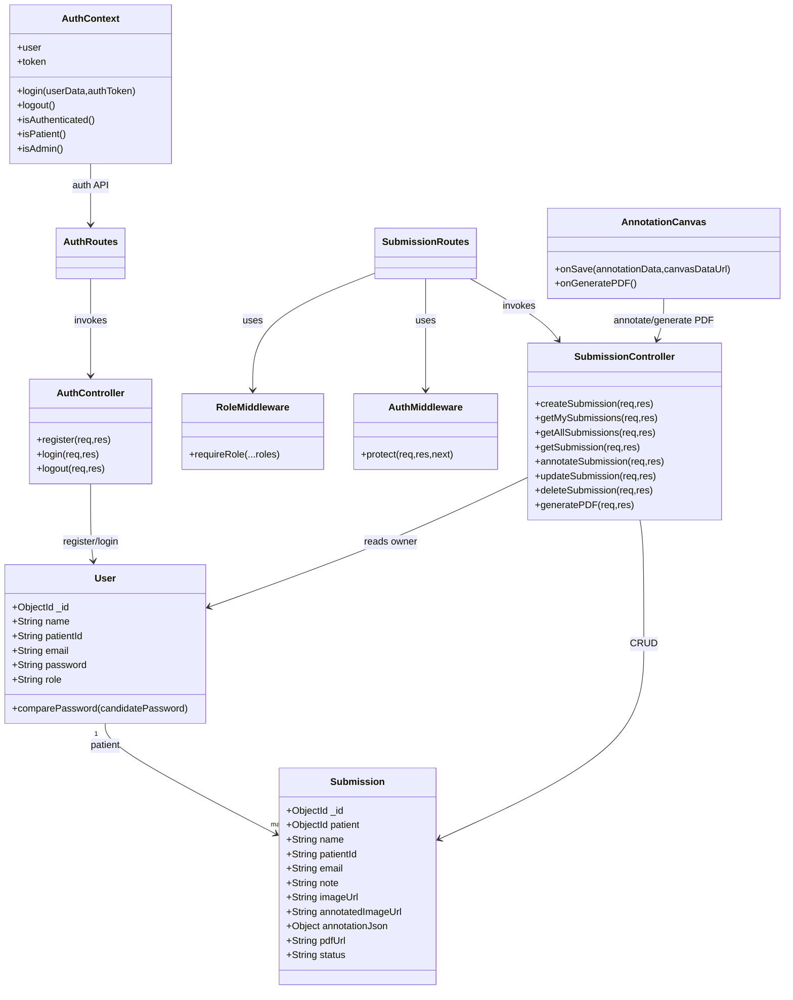

# OralVis Class Diagram

```mermaid
classDiagram
    class User {
        +ObjectId _id
        +String name
        +String patientId
        +String email
        +String password
        +String role
        +comparePassword(candidatePassword)
    }

    class Submission {
        +ObjectId _id
        +ObjectId patient
        +String name
        +String patientId
        +String email
        +String note
        +String imageUrl
        +String annotatedImageUrl
        +Object annotationJson
        +String pdfUrl
        +String status
    }

    class AuthController {
        +register(req,res)
        +login(req,res)
        +logout(req,res)
    }

    class SubmissionController {
        +createSubmission(req,res)
        +getMySubmissions(req,res)
        +getAllSubmissions(req,res)
        +getSubmission(req,res)
        +annotateSubmission(req,res)
        +updateSubmission(req,res)
        +deleteSubmission(req,res)
        +generatePDF(req,res)
    }

    class AuthMiddleware {
        +protect(req,res,next)
    }

    class RoleMiddleware {
        +requireRole(...roles)
    }

    class AuthRoutes
    class SubmissionRoutes
    class AuthContext {
        +user
        +token
        +login(userData,authToken)
        +logout()
        +isAuthenticated()
        +isPatient()
        +isAdmin()
    }

    class AnnotationCanvas {
        +onSave(annotationData,canvasDataUrl)
        +onGeneratePDF()
    }

    User "1" --> "many" Submission : patient
    AuthRoutes --> AuthController : invokes
    SubmissionRoutes --> SubmissionController : invokes
    SubmissionRoutes --> AuthMiddleware : uses
    SubmissionRoutes --> RoleMiddleware : uses

    SubmissionController --> Submission : CRUD
    SubmissionController --> User : reads owner
    AuthController --> User : register/login

    AuthContext --> AuthRoutes : auth API
    AnnotationCanvas --> SubmissionController : annotate/generate PDF
```
