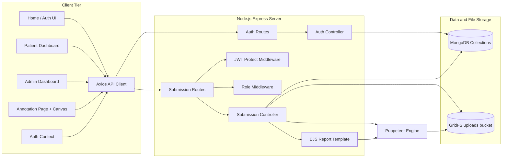

# OralVis Component Diagram

```mermaid
flowchart LR
    subgraph Client_Tier[Client Tier]
        Home[Home / Auth UI]
        PatientDash[Patient Dashboard]
        AdminDash[Admin Dashboard]
        AnnotUI[Annotation Page + Canvas]
        AuthCtx[Auth Context]
        ApiClient[Axios API Client]
    end

    subgraph Server_Tier[Node.js Express Server]
        AuthRoutes[Auth Routes]
        SubRoutes[Submission Routes]
        AuthMW[JWT Protect Middleware]
        RoleMW[Role Middleware]
        AuthCtrl[Auth Controller]
        SubCtrl[Submission Controller]
        PdfTpl[EJS Report Template]
    end

    subgraph Data_Tier[Data and File Storage]
        Mongo[(MongoDB Collections)]
        Grid[(GridFS uploads bucket)]
    end

    Puppeteer[Puppeteer Engine]

    Home --> ApiClient
    PatientDash --> ApiClient
    AdminDash --> ApiClient
    AnnotUI --> ApiClient
    AuthCtx --> ApiClient

    ApiClient --> AuthRoutes
    ApiClient --> SubRoutes

    AuthRoutes --> AuthCtrl
    SubRoutes --> AuthMW
    SubRoutes --> RoleMW
    SubRoutes --> SubCtrl

    AuthCtrl --> Mongo
    SubCtrl --> Mongo
    SubCtrl --> Grid
    SubCtrl --> PdfTpl
    SubCtrl --> Puppeteer

    PdfTpl --> Puppeteer
    Puppeteer --> Grid
```
