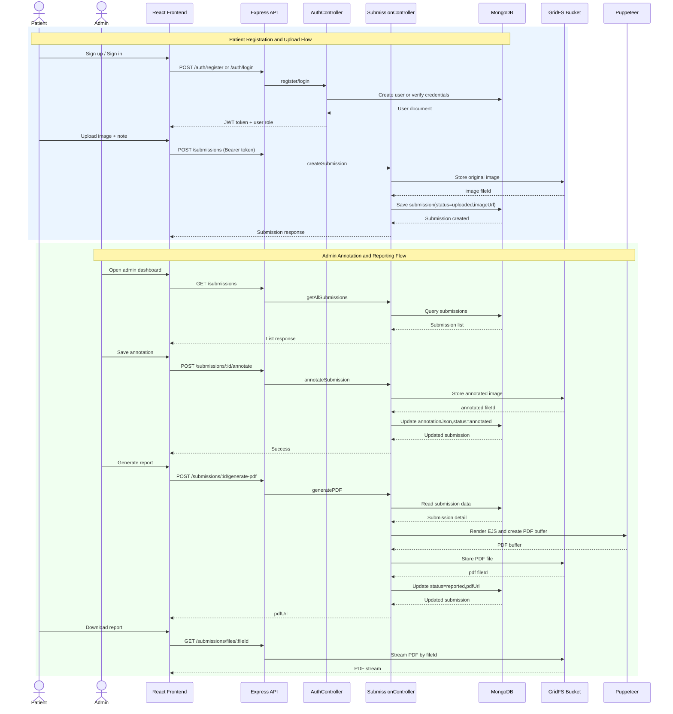

# OralVis Sequence Diagram

```mermaid
sequenceDiagram
    actor Patient
    actor Admin
    participant FE as React Frontend
    participant API as Express API
    participant AC as AuthController
    participant SC as SubmissionController
    participant DB as MongoDB
    participant GFS as GridFS Bucket
    participant PP as Puppeteer

    rect rgb(235, 245, 255)
    Note over Patient,DB: Patient Registration and Upload Flow
    Patient->>FE: Sign up / Sign in
    FE->>API: POST /auth/register or /auth/login
    API->>AC: register/login
    AC->>DB: Create user or verify credentials
    DB-->>AC: User document
    AC-->>FE: JWT token + user role

    Patient->>FE: Upload image + note
    FE->>API: POST /submissions (Bearer token)
    API->>SC: createSubmission
    SC->>GFS: Store original image
    GFS-->>SC: image fileId
    SC->>DB: Save submission(status=uploaded,imageUrl)
    DB-->>SC: Submission created
    SC-->>FE: Submission response
    end

    rect rgb(240, 255, 240)
    Note over Admin,PP: Admin Annotation and Reporting Flow
    Admin->>FE: Open admin dashboard
    FE->>API: GET /submissions
    API->>SC: getAllSubmissions
    SC->>DB: Query submissions
    DB-->>SC: Submission list
    SC-->>FE: List response

    Admin->>FE: Save annotation
    FE->>API: POST /submissions/:id/annotate
    API->>SC: annotateSubmission
    SC->>GFS: Store annotated image
    GFS-->>SC: annotated fileId
    SC->>DB: Update annotationJson,status=annotated
    DB-->>SC: Updated submission
    SC-->>FE: Success

    Admin->>FE: Generate report
    FE->>API: POST /submissions/:id/generate-pdf
    API->>SC: generatePDF
    SC->>DB: Read submission data
    DB-->>SC: Submission detail
    SC->>PP: Render EJS and create PDF buffer
    PP-->>SC: PDF buffer
    SC->>GFS: Store PDF file
    GFS-->>SC: pdf fileId
    SC->>DB: Update status=reported,pdfUrl
    DB-->>SC: Updated submission
    SC-->>FE: pdfUrl

    Patient->>FE: Download report
    FE->>API: GET /submissions/files/:fileId
    API->>GFS: Stream PDF by fileId
    GFS-->>FE: PDF stream
    end
```
