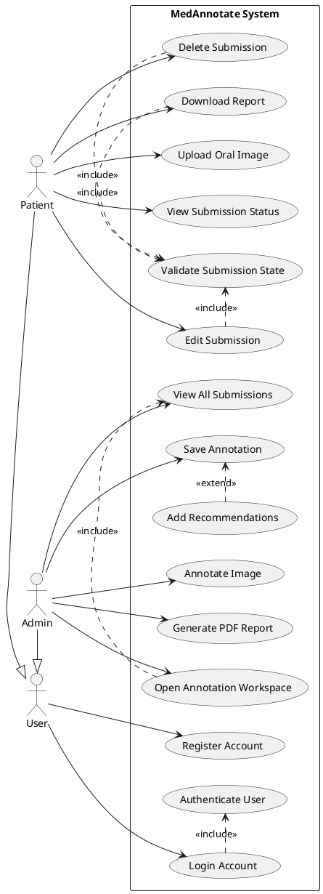

# OralVis UML Use Case Diagram

This diagram follows core UML use case rules:
- actors are external to the system boundary,
- use cases use verb-noun naming,
- the boundary is explicitly named,
- `<<include>>` is used for mandatory reusable behavior,
- `<<extend>>` is used for optional behavior,
- actor generalization is modeled from `Patient` and `Admin` to `User`.

